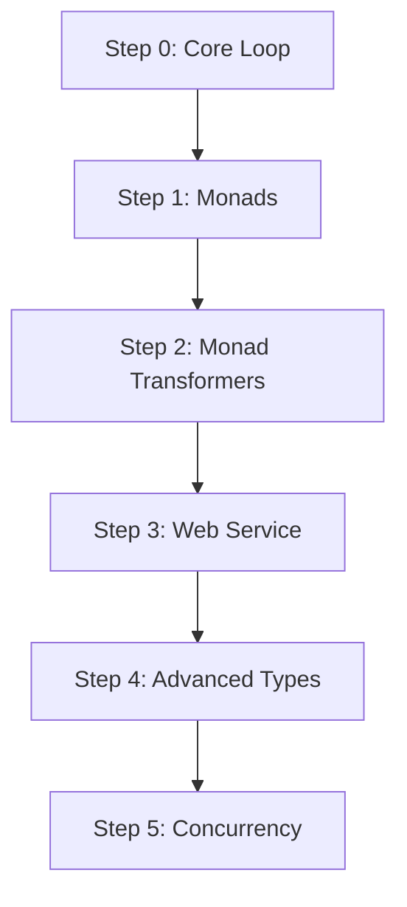

# Haskell Pathfinder

## 📚 Documentation

- **[Drive Folder: Haskell Pathfinder — R&D Lab](https://drive.google.com/drive/folders/1hmhJ19Di_UneyK2jq77ohOGjjPhb4pPn)**
- **[Main Documentation Bundle](https://docs.google.com/document/d/18uXrZDgPDxsV1FMBpKeMzGVHK9OCJr6v4yimVwE1adc/edit?usp=drivesdk)**

This repository is the evolving codebase for a project-centric learning path designed to take an intermediate developer to an advanced level in Haskell. It eschews a theory-first approach in favor of iterative, practical application.

The "real-world application" is not the final exam; it is the first step and the consistent thread through which all concepts are learned. Each step in the accompanying [GUIDE.md](GUIDE.md) corresponds to a Git tag, allowing you to check out the project at any stage of its evolution.

## The Learning Path

The project starts as a simple command-line application and evolves into a full-featured web service.



## Structure

- **`app/`**: Main executable source code.
- **`src/`**: Library code containing the core application logic.
- **`test/`**: Hspec test suite.
- **`GUIDE.md`**: The main tutorial document that drives the learning process.
- **`adr/`**: Architectural Decision Records explaining key technical choices.
- **`stack.yaml`**: The Stack build tool configuration.
- **`package.yaml`**: hpack project and dependency specification.

## Getting Started

1.  **Install Stack:** Follow the instructions at [haskellstack.org](https://docs.haskellstack.org/en/stable/install_and_upgrade/).
2.  **Clone the repository:** `git clone https://github.com/aastom/haskell-pathfinder.git`
3.  **Build and run:**
    ```bash
    cd haskell-pathfinder
    stack build
    stack exec haskell-pathfinder-exe
    ```
