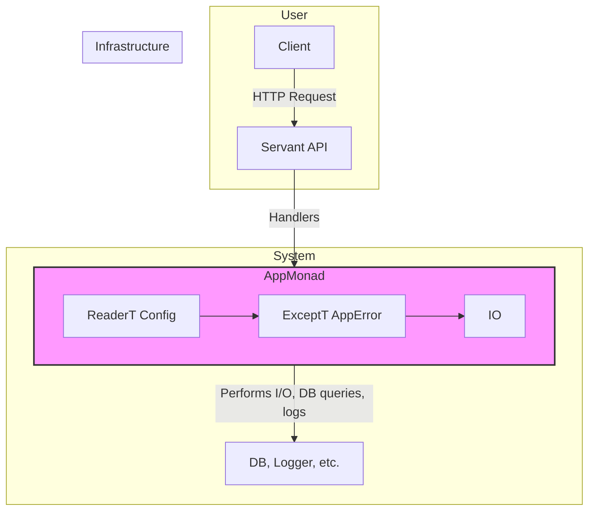

# Target Architecture

This document describes the target architecture for the `haskell-pathfinder` application. The key principle is **Evolutionary Architecture**: the system intentionally starts as a single-file monolith and is refactored into a well-structured, multi-module application.

## Final Architectural Vision

The goal is to build a web service based on a `ReaderT`-based application stack. This provides a clean, maintainable, and extensible structure for managing configuration, state, and effects.

### Components

*   **Servant API:** The API is defined at the type level, ensuring that the implementation (handlers) matches the specification. This catches routing errors, missing parameters, and incorrect response types at compile time.
*   **`App` Monad:** A custom monad stack (`newtype App a = ...`) that unifies the various effects the application needs:
    *   `ReaderT Config`: For read-only access to application configuration (e.g., database connection strings, server port).
    *   `ExceptT AppError`: For structured, typed error handling.
    *   `IO`: The base monad for performing any real-world action.
*   **Infrastructure:** Concrete implementations for logging, database access (using `persistent`), etc.
